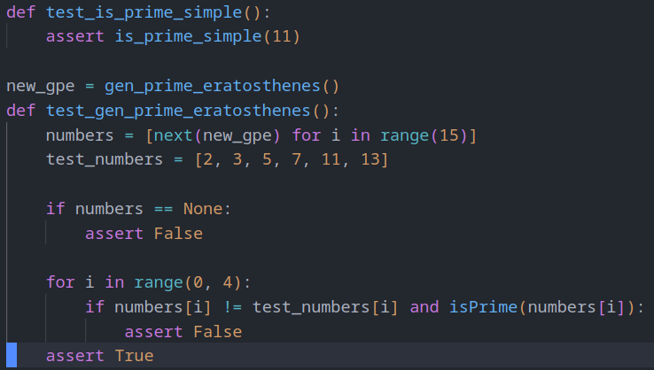
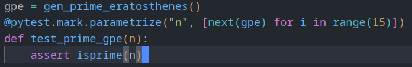
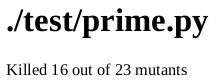
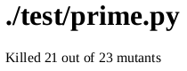

# Atividade 2 de Teste de Software - T01 2024.1
## Aluno: JOAO MARCOS P. CAVALCANTE

- [Descrições](#descrições)
- [Instalação e Utilização](#instalação-e-utilização)
- [Reajustes e/ou Inclusão de Casos de Teste](#reajustes-eou-inclusão-de-casos-de-teste)
- [Melhorias Constatadas](#melhorias-constatadas)

---
---
### Links
- [Link para Repositório Github](https://github.com/JoaoMarcosPC/Teste_Software_Mutantes_2024_Cavalcante_Joao)
- [Link para Tutorial em PDF](./documentos/Joao_Cavalcante_Atividade_2.pdf)
---

### Descrições
- **./codigo** -> onde ficam os executáveis
- **./documentos** -> documentos relevantes à atividade
- **./img** -> imagens utilizadas neste documento
---

### Instalação e Utilização
#### Instalação
- ``python3 -m venv env`` para criar o ambiente virtual
- ``source env/bin/activate`` para entrar no ambiente criado
- ``deactivate`` para desativar o ambiente virtual
- ``pip install -r requirements.txt`` para instalar os pacotes necessários para executar o programa
- ``pip list`` para verificar se os pacotes foram devidamente instalados (algumas dependências serão instaladas junto, mas o importante é que os pacotes "sympy", "mutmut", "pytest" e "pytest-cov" estejam instalados)
#### Utilização
- ``pytest -vv ./test/test_prime.py`` vai executar as rotinas de teste do arquivo "test_prime.py"
- ``mutmut run --paths-to-mutate=./test/`` executa o teste de mutação no arquivo de testes "test_prime.py"
- ``mutmut html`` gera um relatório em html do último teste executado
---

### Reajustes e/ou Inclusão de Casos de Teste
- Foram feitas 3 modificações no arquivo de testes, a inclusão de dois novos casos de teste e a retirada de um:
- 
- A inclusão do teste ``test_is_prime_simple()`` é um simples execução do método de mesmo nome, é passado como argumento o número 11, se o método estiver funcionando corretamente, ele retornará *True*, assim passando no teste. A inclusão deste teste foi responsável por eliminar o mutante 35.
- O ``test_gen_prime_eratosthenes()`` foi criado para substituir um caso de teste existente, o ``test_prime_gpe(n)``:
- 
- O novo método executa primeiramente a mesma função que o antigo: verificar se os números gerados pelo método *gen_prime_eratosthenes()* são de fato números primos, além disso, ele também verifica se os número gerados que são menores do que 15 realmente são os números pertencentes ao crivo de Eratóstenes e se a lista que os contém não é *None*. Com essa nova versão do teste, os mutantes 24, 25, 26 e 28 foram eliminados.
---

### Melhorias Constatadas
- No teste de mutação feito antes das modificações, dos 23 mutantes, 16 foram mortos, 1 demorou demais nos testes e 6 sobreviveram. Foram os mutantes sobreviventes: 24, 25, 26, 28, 35 e 44.
    - 
- Com as melhorias feitas nos testes, dos 23 mutantes, 21 foram mortos, 1 demorou demais nos testes e 1 sobreviveu. O mutante sobrevivente foi o mutante 44.
    - 
- Assim é possível constatar um resultado melhor nos casos de testes, alcançado graças ao retorno dado pelos testes de mutação, com as melhorias aplicadas, houve uma melhora de 31% na quantidade de mutantes mortos, resultando em um código mais robusto.
---
---